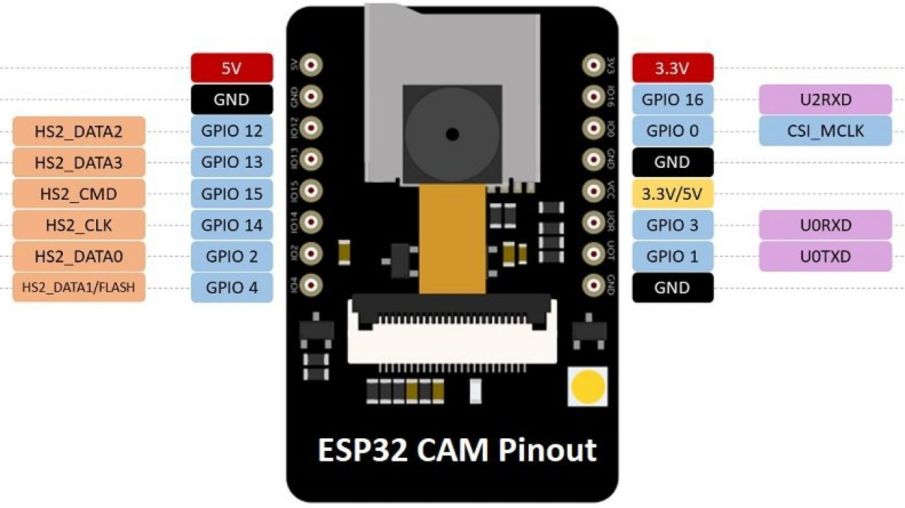
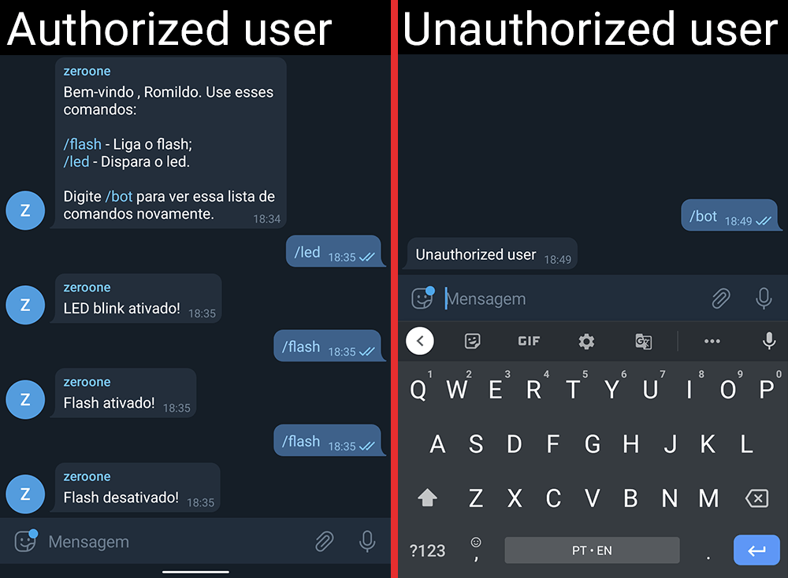

A simple Arduino code for ESP32 to control GPIO with Telegram bot, to use this code you need to [install the ESP32 board on Arduino IDE](https://randomnerdtutorials.com/installing-the-esp32-board-in-arduino-ide-windows-instructions/) and install the [Universal Telegram Bot](https://www.arduino.cc/reference/en/libraries/universaltelegrambot/) library. At the beginning of the [code]() you need to enter your Wi-Fi credentials, your bot token* and your Telegram chat ID**.

```
// Set the Wi-Fi credentials
const char *ssid = "YourWiFiSSID";
const char *password = "YourWiFiPassword";

// Set the Telegram parameters
String BOTtoken = "1234567890:ABCdefgHiJk0MNO1PQrsT1U2_V3Xyz25AYX"; // Your bot token
String CHAT_ID = "1234567891011"; // Your chat ID
```

*If you don't have a Telegram bot or don't know how to find the bot token, follow this tutorial: [How to Create and Connect a Telegram Chatbot](https://sendpulse.com/knowledge-base/chatbot/create-telegram-chatbot)

**To get your chat ID, open [@myidbot](t.me/myidbot) in your telegram and type the /getid command, the bot will be return the your user ID. With you can add your bot to a group, you will need the group ID (see [Get Telegram Chat ID](https://sean-bradley.medium.com/get-telegram-chat-id-80b575520659)), and you need to [allow the bot to have read access to messages in the group](https://stackoverflow.com/questions/50204633/allow-bot-to-access-telegram-group-messages) to receive commands.

In this example, I used an ESP32-Cam board that has an internal led on GPIO 4 and I add an external led on GPIO 2 to test the blink. 


When an authorized user sends /bot command, the ESP32 returns a message with the available commands, if type any commando, will execute the action and reply. If an unauthorized user sends a command, the bot reply "unauthorized user". See the [test video]().



The serial output to debug:

```
Connecting to Wi-Fi SSID
..
ESP32-CAM IP: 123.456.7.890
Reply...
Handle New Messages: 1
Received message: /bot
Reply...
Handle New Messages: 1
Received message: /led
LED blink on!
Reply...
Handle New Messages: 1
Received message: /flash
Flash on!
Reply...
Handle New Messages: 1
Received message: /flash
Flash off!
Reply...
```